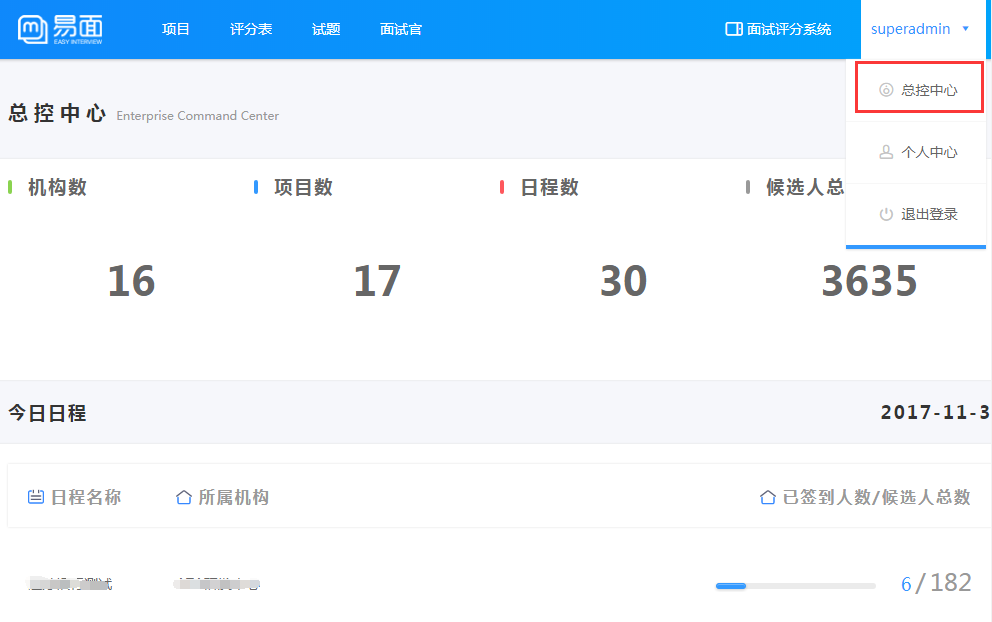
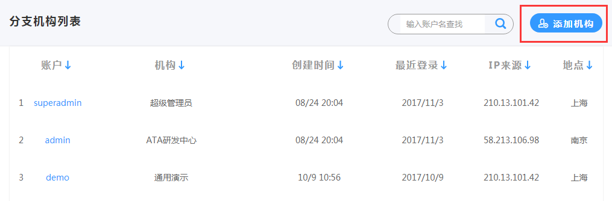
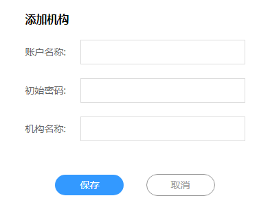

# 总控中心 #

----------

总控中心是专为机构主账户配置的一个管理中心；

展示了机构下的各个数据，可添加机构和查看各个分支机构。

总控中心的作用如下：

- 展示了该账户包含的所有机构数（即子账户）、所创建的总项目数、添加的日程数及候选人总数。

- 展示账户所有机构下的今日日程；展示内容包括日程名称，所属机构，已签到人数和候选人总数。

- 分支机构列表，可点击直接进入分支机构

- 添加机构，创建一个新的分支机构

添加机构：设置账户名称（即为登录名）、密码、机构名即可。

