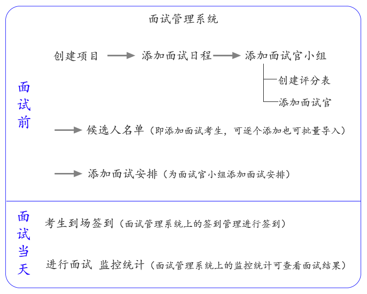

# 入门 #

----------
# 面试管理系统 #

## 易面设备要求： ##

面试管理系统需横屏使用，可使用PC或pad，支持最小设备尺寸为1024*768；

面试官评分系统在ipad上使用效果更佳；

## 快速开始 ##

如何创建一场面试？下图为面试管理系统流程图：

创建面试的过程如下：

- **一、创建项目**

- **二、在该项目里添加面试日程**

- **三、在日程里添加面试官小组**

    注：添加面试官小组时需要选择该面试官小组使用的评分表和面试官，需要提前创建好评分表和面试官。
- **四、添加候选人**
    
    在候选人名单添加候选人，可逐个添加也可批量导入。

- **五、添加面试安排**
    
    为面试官小组添加面试安排，该安排添加后面试官打分系统里会显示。