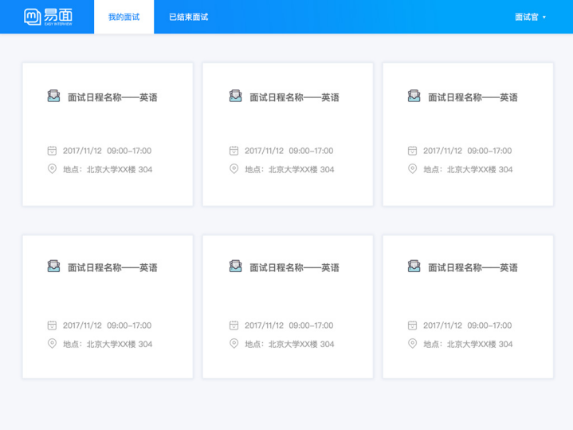
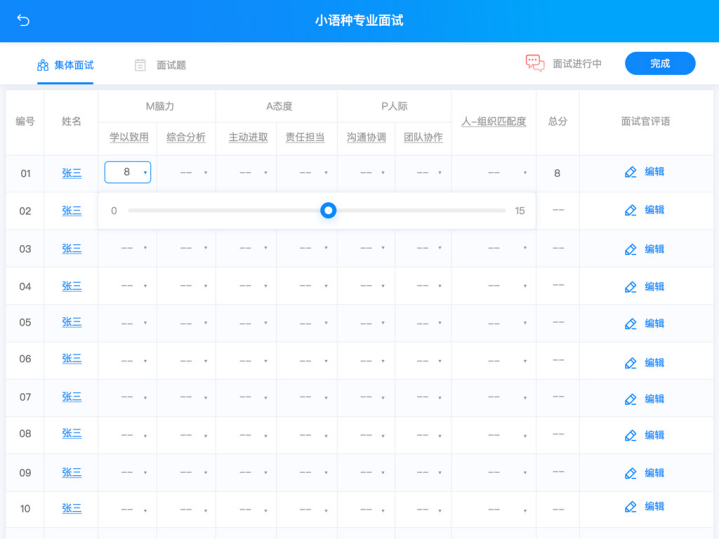
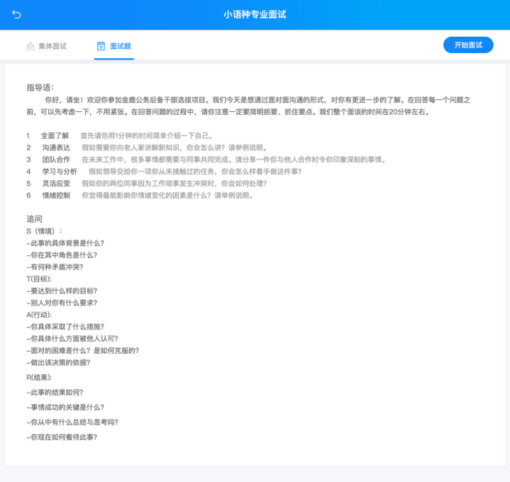

# 我的面试

面试官登陆后即可看到“我的面试”：

## 开始面试

打开面试日程，可以看到该面试日程的相关信息和考生列表，可选择集体面试或单个面试考生；

集体面试：

对一组考生进行打分，免去选择考生的操作，较为省时省力。拖动分数条对考生进行打分即可。

单面：

单面即单独对一个一个考生进行面试，打分界面更为清;

# 面试题

面试题为面试管理员添加（不一定所有面试都有面试题），面试官在面试过程中可以参照面试题对考生进行提问。

