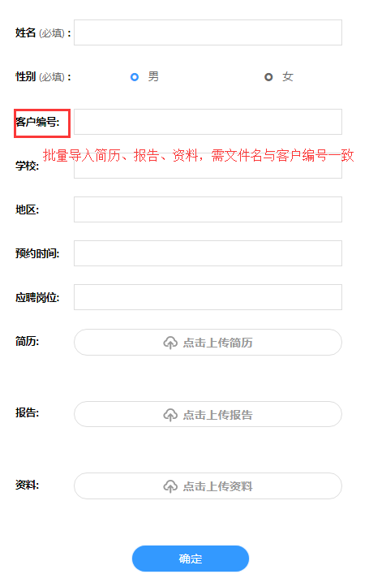
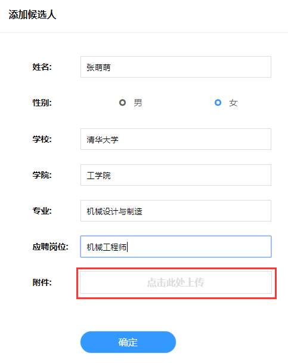
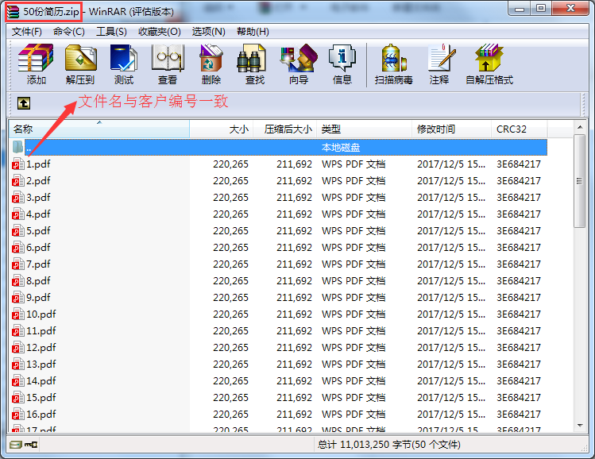

# 候选人名单

添加候选人的方式有两种：

方法一：逐个添加候选人（姓名、性别和应聘岗位为必填项）

方法二：导入候选人名单（下载模版，在模版的excel表格中填写候选人的信息，其中姓名为必填项）

## 候选人附件 ##

为候选人添加附件（照片，简历等等）的方式有两种：

方法一：逐个上传候选人附件

方法二：批量导入，需文件名与候选人姓名对应即可；

选择附件地址，批量选择需要上传的附件

