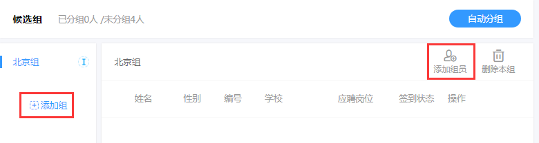
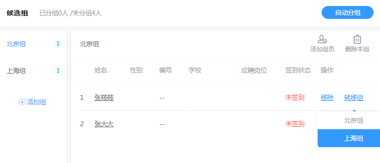

# 候选组管理

候选组即将已添加的候选人分组，在面试安排选择面试对象时可直接选择候选组；

候选组可自主创建并添加候选人也可选择自动分组自动生成候选组：

## 添加组 ##

左侧点击“添加组”输入组名（注意，账户里的候选组组名不能重复）

添加组之后，右侧添加组员即可

## 自动分组 ##

自动对候选人分组，可设置分组对象（全部考生、已签到考生、未签到考生）和分组数进行自动分组。

# 转移组

已分组的候选人可以进行移除和转移，将候选人转移到其他组：

