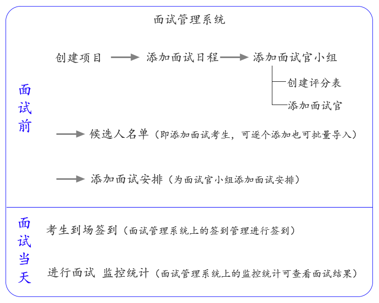

# 入门 #

----------
# 面试管理系统 #

## 易面设备要求： ##

面试管理系统需横屏使用，可使用PC或pad，适配最小设备尺寸为1024*768；

面试官评分系统在ipad上使用效果更佳；

## 快速开始 ##

如何创建一场面试？下图为面试管理系统流程图：

创建面试的过程如下：

- **一、创建项目**

- **二、在该项目里添加面试日程**

    注：添加面试日程时可选择面试轮次（一面，二面，三面）；
       勾选日程配置和面试官权限

- **三、在项目里上传候选人名单**
    
    注：可逐个创建候选人也可批量上传候选人名单。 

- **四、在日程里添加面试官小组**

    注：添加面试官小组时需要选择该面试官小组使用的评分表和面试官，需要提前创建好评分表和面试官。面试题非必选项，可添加供面试官参考。

- **五、在日程里添加候选人**
    
    注：即从第三步项目里已添加的候选人名单里添加。

- **六、添加面试安排**
    
    注：为面试官小组添加面试安排。添加面试安排需要选择面试对象；面试对象为候选人/候选组（候选组管理可添加候选组）。

## 日程配置项 ##

- 创建日程时可设置该日程的所属轮次；
- 签到同时对候选人进行分组；
- 日程内候选人的起始编号；

**面试官权限：**

- 是否允许面试官查看候选人信息
- 是否允许面试官查看最终结果
- 是否允许面试官修改打分结果
- 是否允许面试官查看候选人附件资料
- 是否允许面试官查看历史评分

