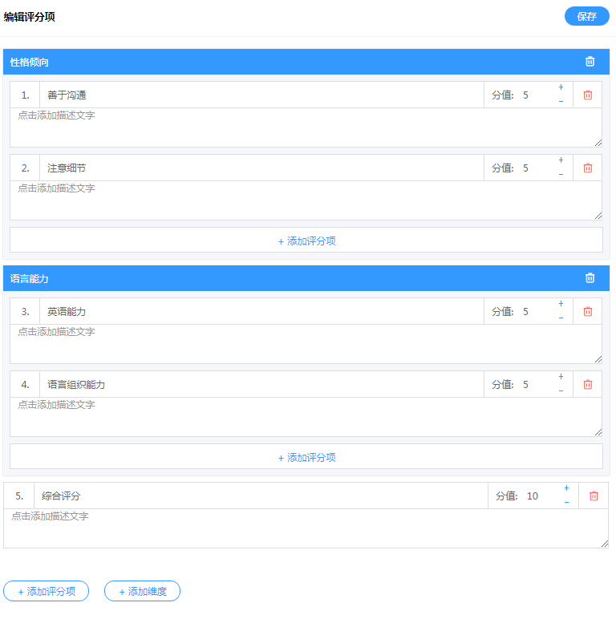
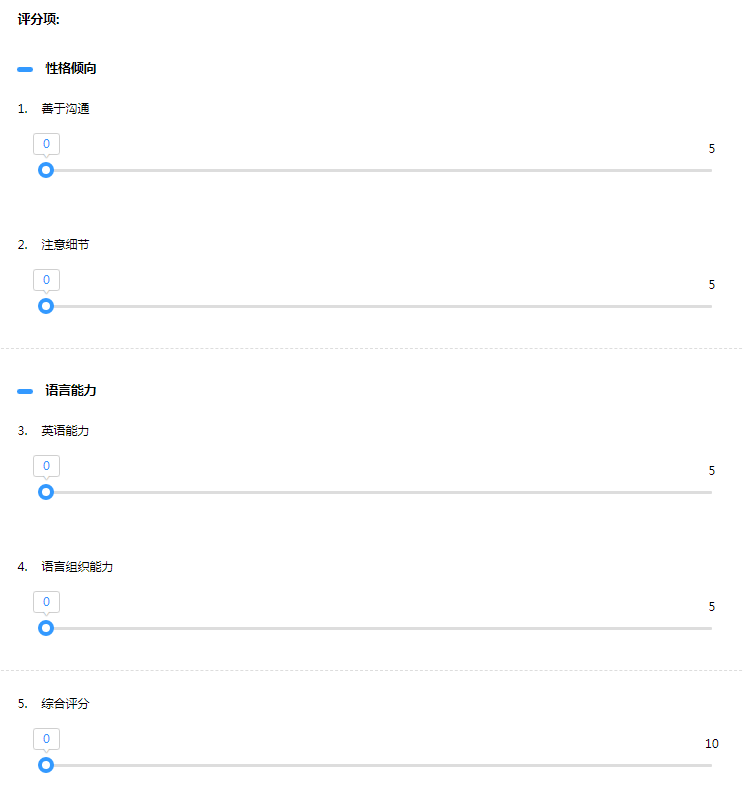
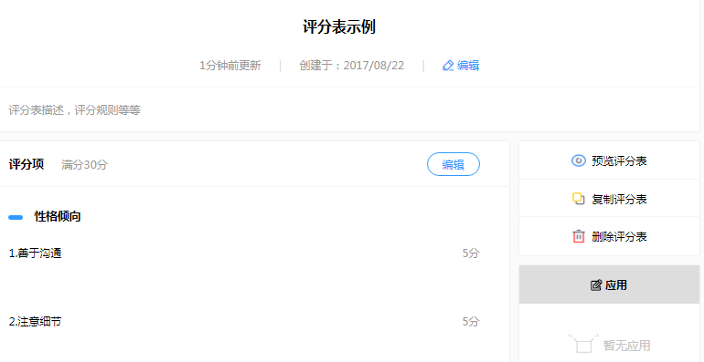

# 评分表

评分表是面试项目不可或缺的一个部分，在创建面试官小组时必须选择该面试官小组使用的评分表，面试官进行面试打分时也是根据该评分表来进行打分。

## 如何创建一个评分表？ ##

* 一、创建评分表
*
* 二、编辑评分项

* 三、添加维度和评分项

    评分表可添加单个评分项，也可添加维度后在维度下添加子评分项：

   评分表预览：

## 复制评分表 ##

复制评分表需注意账户里的评分表名称不可重复

