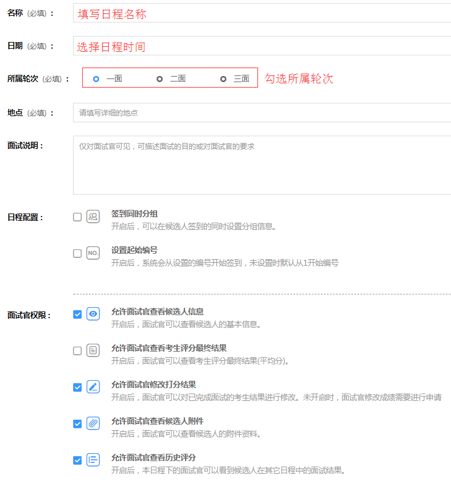

# 日程配置 #

在创建日程时可设置各种配置项：

- 设置该日程的所属轮次；

- 签到同时对候选人进行分组；

- 日程内候选人的起始编号；

**面试官权限：**

- 是否允许面试官查看候选人信息：
       
> 注：允许面试官查看候选人信息为候选人基本信息（不包括简历等附件资料）。

- 是否允许面试官查看最终结果：
   
> 最终结果为考生评分最终的平均分；

- 是否允许面试官修改打分结果：
   
> 若不开启，面试官要修改已完成面试的考生结果时需要先申请，同意后才可修改。

- 是否允许面试官查看候选人附件资料

- 是否允许面试官查看历史评分
    
> 本日程下的面试官可以看到候选人在其他日程的面试结果（限该项目下的日程）。