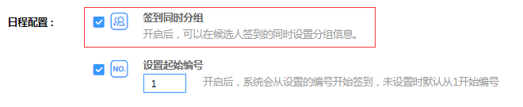
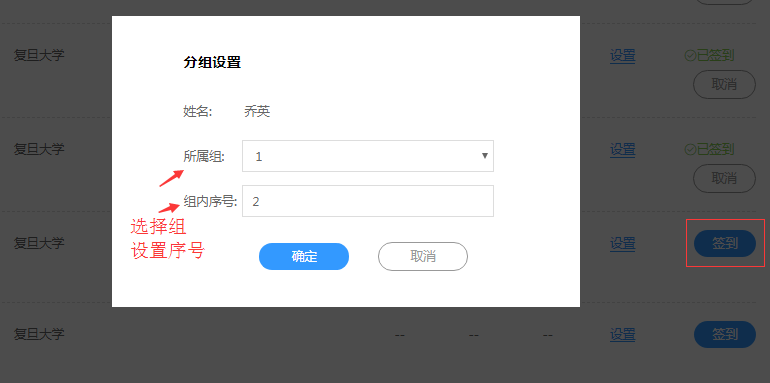
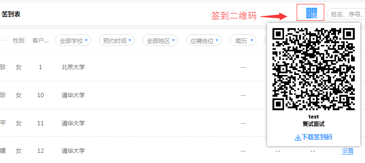
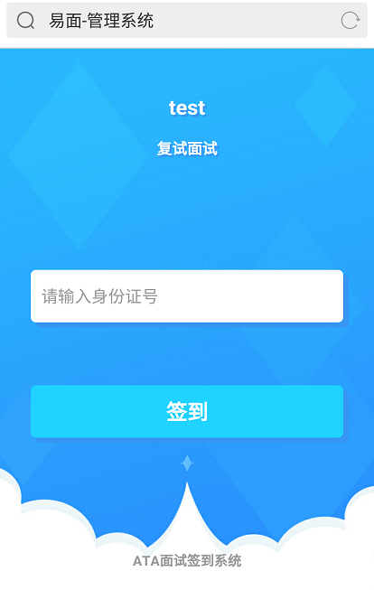
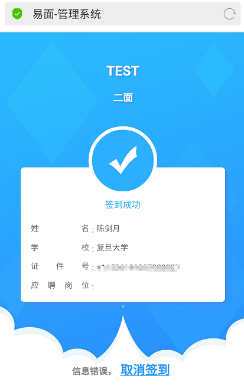

# 签到管理 #

----------

考生签到分为两种情况：

- 1.直接签到

- 2.签到同时分组

## 签到同时分组 ##

签到同时分组为创建日程时勾选的配置项：

开启签到同时分组的日程，考生签到之前需要先创建候选组（在候选组管理添加组即可）：

签到同时进行分组设置，选择所属组并设置组内序号（组内序号即面试官打分候选人列表序号）：

开启签到同时分组的日程也可直接签到不进行分组，在签到分组设置是点取消即可不分组直接签到。

## 二维码签到 ##

面试签到方式可采用二维码签到，以便考试到场后自行签到；

**注意：**

- 二维码签到时考生需要使用身份证号，故考生信息需填写好身份证号；
- 考生扫面二维码签到，若要签到时分组需提前在签到表设置分组；

考生扫描二维码签到后若发现信息有误可取消签到，页面如下：

