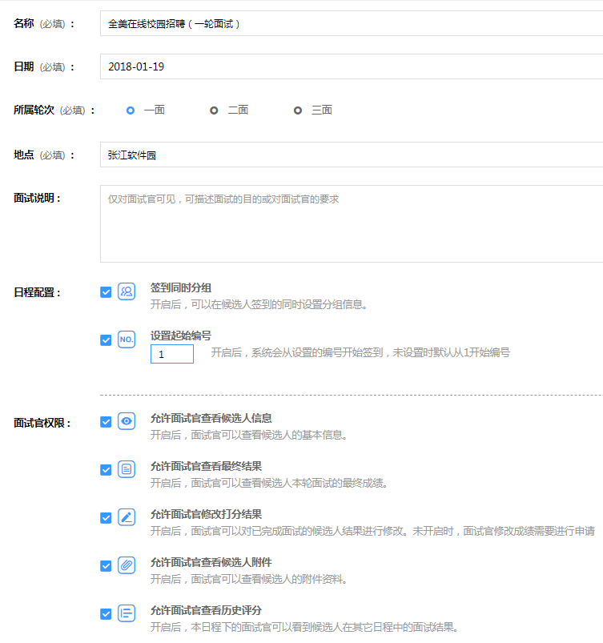

# 创建日程 #

**如何创建一个面试日程？**

- **一、创建项目**

- **二、在该项目里添加面试日程**

- **三、在日程里添加面试官小组**

    注：添加面试官小组时需要选择该面试官小组使用的评分表和面试官，需要提前创建好评分表和面试官。

- **四、添加候选人**
    
    在候选人名单添加候选人，可逐个添加也可批量导入。
    
    如需将候选人分组可在“候选组管理”进行分组。
    
    详细可查看[候选人名单](http://help.ezinterview.org/docs/project3.html "候选人名单")

- **五、添加面试安排**
    
    为面试官小组添加面试安排，该安排添加后面试官打分系统里会显示。
    
    设置面试时间和面试对象（面试对象可为多个候选人也可为候选组）

## 面试轮次的作用 ##

- 面试安排，选择面试对象时，在候选人信息中添加一条为已参面的评分结果。

- 候选人可以由日程a导入日程b，并可设置是否携带本日程下的面试结果进行导入。可以对二面人员进行重新分组，并可以将二面和已面分日期进行。
