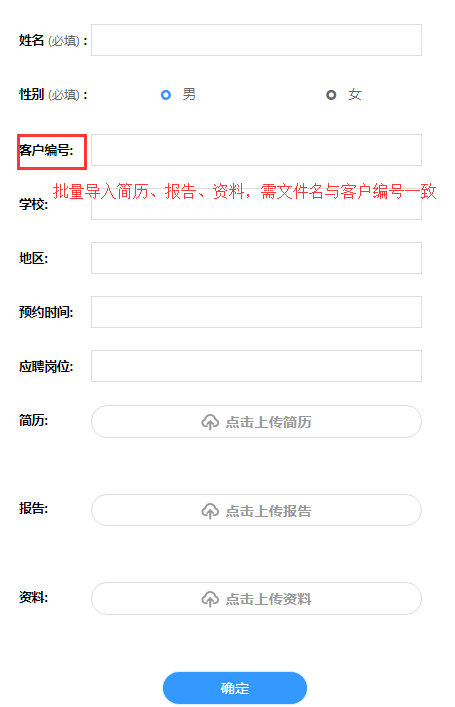
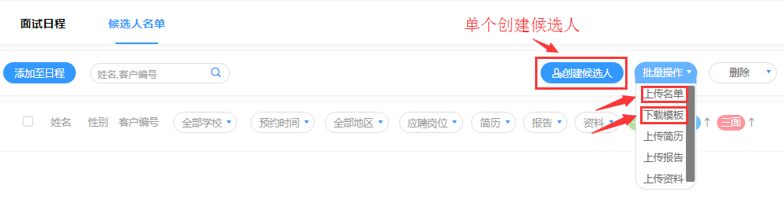
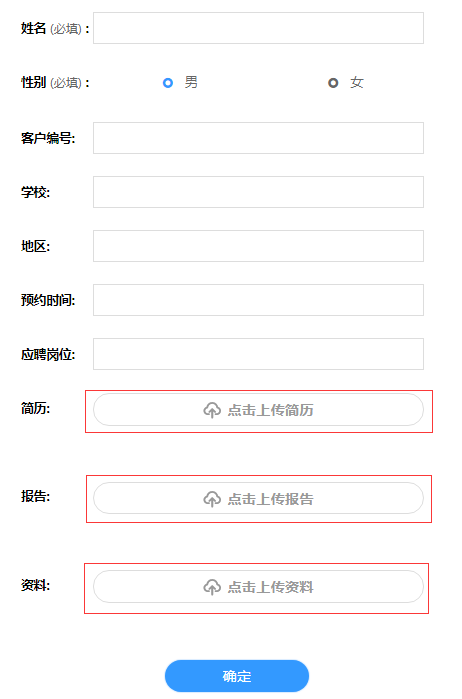
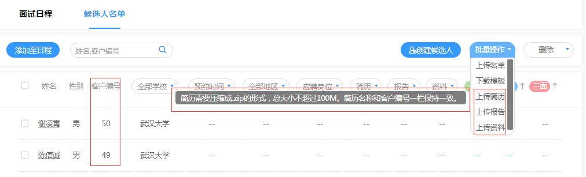
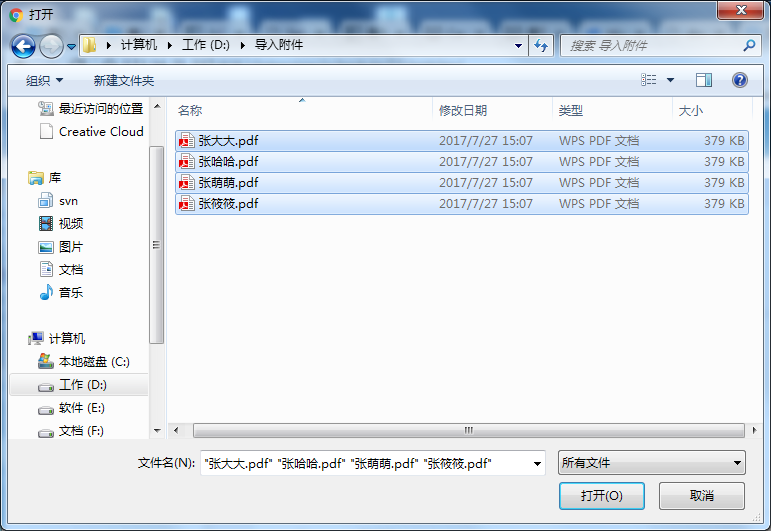

# 候选人名单

面试日程里添加候选人需要先在项目下创建候选人；

项目下添加候选人的方式有两种：

**方法一：**逐个添加候选人（姓名、性别为必填项）

**方法二：**批量导入候选人（下载模版，在模版的excel表格中填写候选人的信息，其中姓名为必填项）

> **注：不论单个添加或批量导入，若之后需要导入简历、报告或资料，需要填写客户编号；**

## 候选人附件 ##

可以为候选人上传3个附件，包括简历、报告、资料。为候选人添加附件的方式有两种：

**方法一：**逐个上传候选人附件

**方法二：**批量上传，需文件名与客户编号一致，然后将所有文件压缩为.zip格式，总大小不超过100M。

选择附件地址，批量选择需要上传的附件

